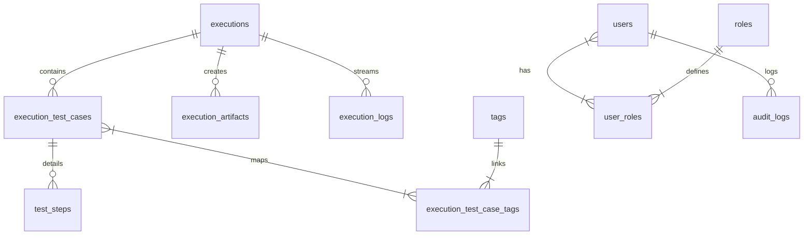

# Automation Portal — Comprehensive Project Analysis (v1.1.0)

This documentation provides an end-to-end audit of the **Automation Portal** project. It details the system architecture, database schema, and existing implementations (what is **DONE**), and outlines the remaining enhancements and feature gaps (what is **LEFT / TO IMPLEMENT**).

Use this document to analyze current capabilities and plan next-phase developer tasks.

---

## 1. Project Context & Purpose

The **Automation Portal** acts as the primary execution, reporting, and quality analytics suite for the hybrid Selenium, TestNG, and Extent automation framework located at:
```text
D:\New folder\MPHIDB
```
The goal is to provide a single, unified, dark-themed dashboard that triggers test runs, captures framework artifacts, processes test results, highlights regressions, flags flaky tests, and compares historical runs, all with strict role-based access control.

---

## 2. Technical Stack

* **Backend**: Spring Boot 3, Java 21, Hibernate/JPA, Flyway (DB Migrations), Maven, Spring Security (JWT-based token & refresh tokens).
* **Database**: MySQL 8.
* **Frontend**: React SPA (Vite-based), Vanilla CSS (`styles.css`), Lucide icons.
* **Deployment**: Docker Compose orchestrating three nodes:
  * `automation-portal-mysql` (MySQL database)
  * `automation-portal-backend` (Spring Boot API)
  * `automation-portal-frontend` (Nginx serving React build assets)

---

## 3. Database Schema Status

All tables are set up via Flyway migration scripts.



### Active SQL Schemas
1. **`executions`**: Holds suite run summaries, overall status (`QUEUED`, `RUNNING`, `PASSED`, `FAILED`, `PARTIAL`, `CANCELLED`, `ERROR`), counts, duration trends, environment types (`DEV`, `SIT`, `UAT`, `PROD`), and server system parameters.
2. **`execution_test_cases`**: Stores parsed test methods, their durations, stack traces, parameters, and screenshots.
3. **`test_steps`**: Chronological log steps for each test method (extracted from `<reporter-output>`).
4. **`tags` & `execution_test_case_tags`**: Tracks annotation groups (e.g. `@smoke`, `@regression`).
5. **`execution_artifacts`**: Links physical files (Extent HTML report, TestNG XML, images) to execution codes.
6. **`execution_logs`**: Tracks console execution logs in real-time.
7. **`users` & `roles`**: Stores credentials and authorities (`ROLE_USER`, `ROLE_ADMIN`, `ROLE_SUPER_ADMIN`).
8. **`audit_logs`**: Logs Super Admin user management changes.

---

## 4. Current Implementation Status (What is DONE)

### 4.1 Backend Engine
* **Execution Runner Worker (`ExecutionWorker.java`)**:
  * Polls queued executions sequentially.
  * Cleans framework directories (`test-output`, `screenShots`, `logs`) to prevent cross-run pollution.
  * Executes standard TestNG maven commands (`mvn test -DsuiteXmlFile=...`) via process subprocesses.
  * Streams stdout/stderr directly into database execution log lines.
  * Gathers system runtime parameters (OS, Java, host, browser driver versions) from the machine.
  * Archives generated Extent reports, screenshots, and logs under `artifacts/executions/<execution_code>/`.
* **Structured TestNG XML Parser (`TestNGXmlParser.java`)**:
  * Parses TestNG results.
  * Captures retry count by tracking repeating test methods.
  * Links group nodes to tag entities.
  * Parses `<reporter-output>` line entries to create sequential `TestStep` entries.
  * Propagates exceptions and stack traces down to the failed step.
* **Analytics Queries (`DashboardService.java`)**:
  * Implements SQL groupings to compute daily pass-rate curves, duration trends, run heatmaps (day × hour), and environment distribution.
  * Detects regression alerts (detects when a module changes status from `PASSED` to `FAILED` between consecutive runs).

### 4.2 User Workspace (Normal Portal)
* **Dashboard Widgets**: Includes custom analytics controls:
  * *Regression alerts banner*: Highlights quality drops with links to comparative reports.
  * *Trend chart*: SVG Bezier pass-rate curves.
  * *Duration sparkline*: Nested bar charts in KPI cards.
  * *Module Analytics*: Interactive table detailing total, passed, failed, skipped, and accuracy progress indicators for each module, matching the MasterReport2.html style.
  * *Environment progress distribution*: Breakdown of run counts by pipeline.
  * *Activity heatmap*: 7×24 hour-by-hour run intensity grid.
  * *Stability Analytics*: Highlights test methods with high flakiness indices or retry rates.
  * *System & Run info*: System configurations matching the latest execution.
* **Execution Center**: Triggers test runs (All modules, specific module, or custom XML suite path).
* **Reports Center**: Historical list of reports with links to view Extent HTML report files, TestNG HTML files, and raw XMLs.
* **Test Logs Viewer**: Scrolling dark console containing raw thread logs.
* **Screenshots Gallery**: Displays visual snapshots of failed test cases.
* **Historical Compare**: Renders side-by-side run evaluations with test outcome status deltas (New failures, fixed tests, still failing, skips).
* **Environments**: Renders endpoints configuration listings.
* **Profile**: Edit user details, profile avatar upload, password changes, and user activity trace logs.

### 4.3 Administrative Workspace (Super Admin Area)
* **Secure Isolation**: If a user has `ROLE_SUPER_ADMIN`, they can navigate to a completely separated administration area. Regular users attempting to enter receive a styled `403 Forbidden` screen.
* **Admin Dashboard Overview**: Shows user count widgets, database health parameters, and recent audit logs.
* **User Management**:
  * Paginated, searchable grid of registered credentials.
  * Create, Edit, Reset Password, and Toggle (Enable/Disable) controls that persist changes to MySQL.
  * Delete User action with confirmation prompt. Deleting oneself or other Super Admin accounts is prevented.
  * Modal backdrop configuration ensures forms do not close when clicking outside.

---

## 5. Feature Gaps & Remaining Work (What is LEFT to Implement)

This section maps outstanding tasks that need implementation in upcoming phases.

### 5.1 Custom JSON Listener (Phase 4 Roadmap Integration)
* **Goal**: XML parsing of `testng-results.xml` is fragile. A custom TestNG listener should output structured JSON to the portal.
* **What to Implement**:
  * Create a Java listener class `PortalResultListener.java` inside the Selenium repository (`D:\New folder\MPHIDB`).
  * Implement `ITestListener` and `ISuiteListener` interfaces to construct a clean output file `test-output/portal-results.json` containing test metadata, steps, tags, and direct screenshot paths.
  * Update `ExecutionWorker.java` and `TestNGXmlParser.java` in the portal backend to prioritize parsing `portal-results.json` if available, falling back to XML otherwise.

### 5.2 Real-Time Updates & Streaming (Phase 6 Roadmap Integration)
* **Goal**: Replace HTTP polling on running executions with real-time pushes.
* **What to Implement**:
  * **Spring Boot Websockets/SSE**: Configure a Spring Boot Server-Sent Events (SSE) or WebSocket message broker endpoint under `/api/executions/{id}/live-stream`.
  * **Worker Logs Push**: Modify `ExecutionWorker.java` to push stdout/stderr log lines directly to connected subscribers as they are captured, rather than database polling.
  * **Frontend Live Panel**: Update `LogsViewer.jsx` and the run trackers to subscribe to the streaming channel when a run is active, showing live terminal lines on screen.
  * **Live Progress Indicators**: Display running progress percentage indicators on the dashboard using TestNG method counters.

### 5.3 Administrative Workspace Extensions (Placeholder pages)
* **Goal**: The Admin workspace has several placeholder screens that need database persistence and UI management pages.
* **What to Implement**:
  * **Role Management**:
    * Create a schema mapping specific access permissions/scopes to roles (e.g. `SCOPE_RUN_TESTS`, `SCOPE_EDIT_USERS`, `SCOPE_DOWNLOAD_REPORTS`).
    * Implement the Role Management UI page inside the Admin workspace to display a permission matrix grid.
    * Build backend APIs to update role capabilities.
  * **Access Management**:
    * Create tables for IP allowlists, login retry limits, and JWT token expirations.
    * Implement an Access Management UI console to save these values.
    * Connect these settings to Spring Boot Security filters (e.g. validating login client IP addresses against configured allowlists).

### 5.4 Enterprise Integrations (Phase 7 Roadmap Integration)
* **Goal**: Link test quality metrics to external enterprise project management systems.
* **What to Implement**:
  * **Jira / Azure DevOps Integration**:
    * Add a button on execution detail test failure rows: *"Create Bug in Jira"*.
    * Connect to Jira REST APIs to automatically file defect tickets containing the failed test name, exception reason, screenshots, and stack trace logs.
  * **CI/CD Integration**:
    * Add support to trigger executions directly on remote Jenkins or GitLab pipelines instead of running them on the local host machine.
  * **AI Failure Analysis**:
    * Integrate an AI classifier to process stack trace strings and suggest resolution paths (e.g. flagging a TimeoutException as *"Fragile locator: Locator timed out after 10s. Elements on DOM might have changed."*).

---

## 6. Gap Analysis Summary

| Feature / Page | Current Status (Done) | Remaining Implementation Tasks (Left) |
|---|---|---|
| **Test Parsing** | XML parsing (`TestNGXmlParser`) | Write custom framework JSON listener (`portal-results.json`) |
| **Log Viewer** | Static view of logs from DB | Live websocket/SSE log streaming for running builds |
| **Runner Progress** | Queued/Running status tags | Real-time percentage progress bars and current-step tags |
| **Role Management** | Static UI placeholder panel | Dynamic permissions matrix grid with API endpoints |
| **Access Management** | Static UI placeholder panel | IP allowlists, login thresholds, and security filter logic |
| **Jira Integration** | None | Bug creation APIs mapped to execution failures |
| **AI Classifier** | None | Exception trace text analysis & error categorization |
| **Jenkins Integration** | Runs on local host machine | Remote webhook triggers for CI servers |
