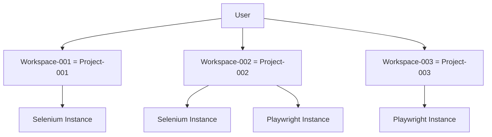
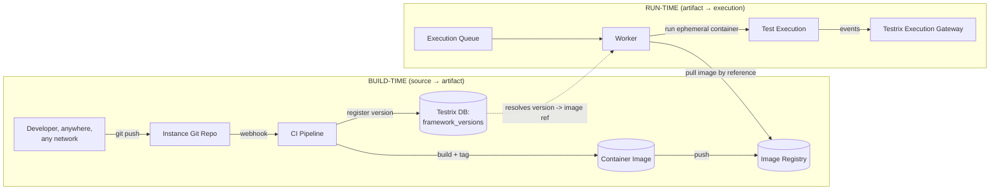
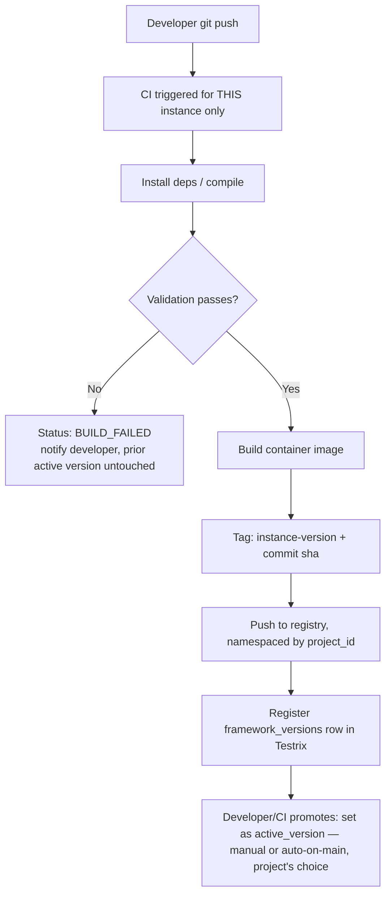
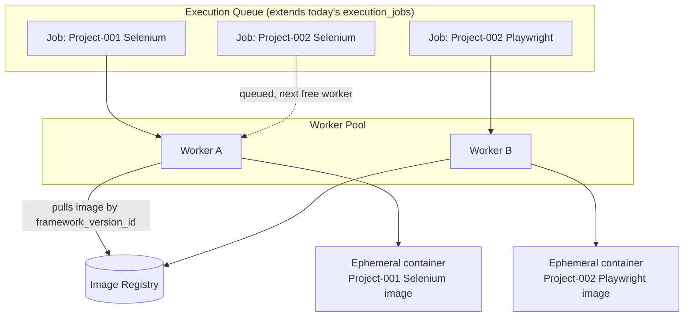
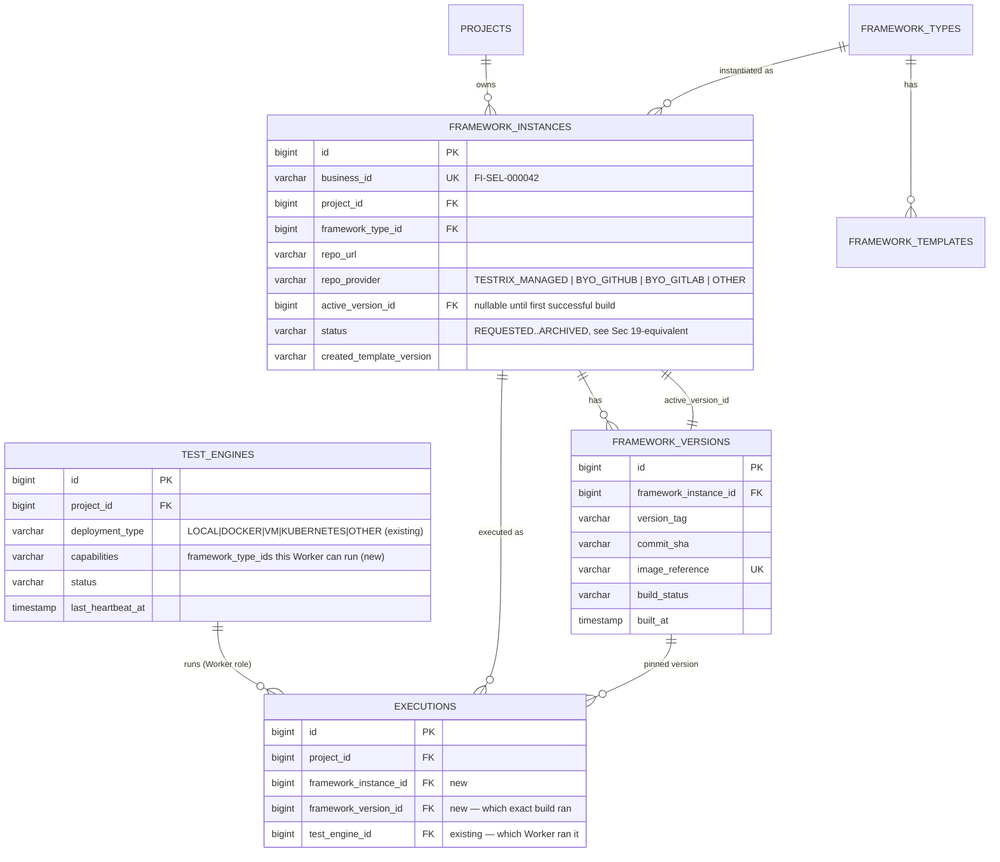
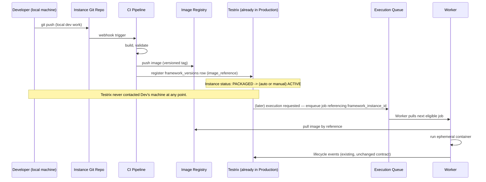
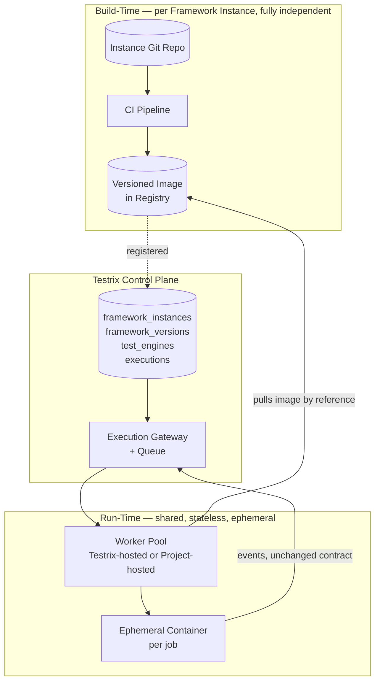

# Testrix — Multi-Project Framework Lifecycle Architecture (Plan 3)

> Answers `docs/problem.md` in full. Written 2026-08-12. This is an **architecture decision
> document**, not an implementation plan — no code is proposed here, per the source document's
> explicit instruction. It extends, not replaces, work already done:
> - Plan 1 (`version2.1.md`/`version2.2.md`) — tenant/project/workspace isolation. Still the
>   ownership root: a Framework Instance belongs to exactly one `project_id`, same as everything
>   else in the platform.
> - Plan 2 (`version2.3.md` → `test-engine-integration-architecture.md`) — the Test Engine
>   Registry: per-project identity, hash-only credentials, project-scoped callback validation.
>   **This document does not replace `test_engines` — it extends it into the Worker role** (§10).
> - `docs/automation-framework-connection.md` — first documented the gap this closes (§3: "one
>   shared framework connection for the whole platform") and sketched an early version of §7 below.
>
> Grounded in the actual current pipeline (`docker-compose.yml`, `FrameworkRunnerService.java`,
> `ExecutionWorker.java`, `test_engines`/`test_engine_credentials`) — not a greenfield rewrite.
> Today's mechanism (event contract, `execution_code`, per-engine credential) is correct and stays;
> what's missing is everything *around* it that decides which code an execution actually runs.

---

## 1. Executive Summary

Today, Testrix can tell **which project an execution event belongs to** (Plan 2, live), but it
cannot tell **which project's own code actually ran** — every Selenium execution, for every
project, runs the same `D:/New folder/MPHIDB` checkout; every Playwright execution runs the same
`D:/playwright-js` checkout. This works only because there is exactly one real workspace today.

The fix is not "give every project its own permanent server." It's recognizing that a Framework
Instance has **two independent lifecycles that get conflated today**:

1. **Build-time** — a project's test code, as source, evolving in its own Git repository,
   independent of whether Testrix itself is running locally or in production.
2. **Run-time** — a specific, already-built, versioned artifact (a container image) being executed
   for a specific job, by whichever Worker picks that job off the queue.

Once those two are separated, every question in `problem.md` — local↔production, 1 project↔10,000
projects, one framework type↔many, one project↔many framework types — resolves the same way:
**source lives in Git, builds produce a versioned image, images live in a registry, executions are
ephemeral containers run by a Worker pool, and Testrix's database stores only pointers to all of
the above.** Testrix is never in the business of hosting, running, or permanently storing anyone's
test code — it orchestrates and records.

---

## 2. Exact Problem Definition

> How should Testrix manage, develop, deploy, communicate with, execute, version, update, and scale
> hundreds or thousands of project-specific automation frameworks without creating one massive
> shared framework?

Restated precisely: Testrix's own multi-tenancy (API Testing, Performance Testing) is a **data
isolation** problem, solved by `project_id` foreign keys, because the "thing being multi-tenanted"
is rows in Testrix's own database. Automation is a **code + compute isolation** problem, because
the thing being multi-tenanted is *someone else's executable code*, with its own dependencies,
versions, and release cadence. The two problems look similar (both need "isolate per project") but
require entirely different mechanisms — this document is only about the second one.

---

## 3. Current Architecture & Why It Doesn't Scale

```
docker-compose.yml (products/automation-portal)
  Selenium/TestNG  →  bind mount  →  AUTOMATION_FRAMEWORK_REPO_PATH  (D:/New folder/MPHIDB)
  Playwright       →  bind mount  →  AUTOMATION_PLAYWRIGHT_PATH      (D:/playwright-js)
```

- **One checkout per engine type, for the entire platform.** A second project's Selenium code has
  nowhere to go except into the same MPHIDB checkout as more suites/spec folders.
- **One shared Framework Runner container** (`framework-runner/`) executes `mvn test` or
  `npx playwright test` with `cwd` pointed at the static mount — it has no concept of "which
  project's code" beyond whatever suite XML/spec path it's told to run inside that one checkout.
- Credential isolation is solved (Plan 2), but code isolation is not — a second real client
  workspace has no way to bring an independent codebase without hand-editing the shared checkout,
  which is workable for one internal team, not for N unrelated clients.

Concretely, at 1,000 projects with ~1.5 average framework instances each, this model would require
either (a) 1,500 different test suites hand-merged into two folders with no version boundaries, no
independent dependency versions, no independent release cycles, and one broken `npm ci` blocking
everyone — or (b) 1,500 permanently-running bind-mounted containers, which nobody is proposing and
which the source document correctly forbids (§6, §38). Neither is viable; a third model is needed.

---

## 4. Core Isolation Model

The absolute rule from `problem.md` §1 is already true in the platform's data model and does not
need to change: **one Project → exactly one Workspace → one or more Framework Instances.**
`Workspace` and `Project` are the same row in this codebase (confirmed independently in
`docs/automation-framework-connection.md` — no separate `workspaces` table exists, `project_id` is
already the tenancy key everywhere). Nothing in this document introduces a second isolation
concept; Framework Instances simply get their own table, FK'd to `project_id`, exactly like
`test_engines` already is.



Same user, three projects, four framework instances — none of them share a repository, an image, a
credential, or a runtime. `LoginSuite` in Project-001's Selenium instance and `LoginSuite` in
Project-002's Selenium instance cannot collide because they are not namespaced-by-convention inside
one codebase — they are **physically separate codebases, separate images, separate registry rows.**
This is the difference between "isolated by discipline" (today, fragile) and "isolated by
construction" (target, cannot be violated by a mistake).

---

## 5. Framework Type vs Template vs Instance

Four distinct concepts, each needing its own identity (per §4/§20 of the source document):

| Concept | What it is | Example | Lives where |
|---|---|---|---|
| **Framework Type** | The technology | `SELENIUM`, `PLAYWRIGHT`, (later) `CYPRESS` | A string/enum in `framework_types` — already effectively `ModuleEntity.runnerType` today, promoted to a first-class row |
| **Framework Template** | Testrix-maintained starter codebase for a type | `selenium-template` repo, semver-tagged | Its own Git repo, centrally maintained |
| **Framework Instance** | One project's actual codebase, derived from a template | `project-002-selenium` | Its own Git repo, owned by the project |
| **Framework Version** | One built, immutable snapshot of an Instance | commit `a1b2c3d` → image `v1.4.0` | A row referencing a Git ref + an image reference |

A Framework Instance is created **from** a template (a one-time copy, not a live link — see §7 for
why) and then evolves completely independently. Two instances of the same type share nothing at
runtime; they share only a common ancestor at creation time, the same way two repos created from
the same GitHub template share nothing after the first commit.

---

## 6. The Central Insight: Build-Time vs Run-Time Are Independent

This is the mechanism that answers `problem.md` §10/§11 (the "most critical" scenario) directly,
so it's called out before the rest of the document, which is organized around it.



**Why this dissolves the "Testrix production, framework local" paradox:** a developer's laptop
never needs to be reachable by Testrix, ever, at any stage. It only needs outbound reachability to
a Git remote (already true for any developer, on any network, today) and, for the CI step, outbound
reachability to a registry (also standard). By the time an execution is even possible, the code has
already left the laptop and become an immutable, addressable image — a *build-time* artifact, not
*run-time* local state. Testrix, whether local or already deployed to production, only ever talks
to the registry and the queue — both of which exist and are reachable independent of any individual
developer's machine.

This is also why `git push` alone (§38: "Git alone solves deployment") is correctly called out as
insufficient in the source document: Git gets code off the laptop, but an execution needs a
runnable, versioned, dependency-resolved artifact — that's what the CI/image step provides. Git
solves the developer-reachability problem; the image/registry step solves the "what exactly runs"
problem. Both are required, neither alone is sufficient.

---

## 7. Framework Storage & Source Management

Evaluated against `problem.md` §14's alternatives:

| Option | Verdict | Why |
|---|---|---|
| Local filesystem (today) | **Rejected** | Single point of coupling to one machine; the entire problem this document solves |
| One central repo, all instances as folders | **Rejected** | Recreates §6's "massive shared framework" — one broken dependency blocks every project, no independent branch/release history |
| Object storage for source | **Rejected** | Source code needs diff/branch/history/collaboration; object storage has none of that natively — wrong tool |
| **Git repository per Framework Instance** | **Recommended** | Independent history, branches, permissions, CI triggers, and — critically — independent *failure*: a broken push to Project-002's Selenium repo cannot affect Project-001's |
| Container/image registry (for source) | **Rejected for source**, but **required for the built artifact** — see §9 | Registries store built artifacts, not editable source; conflating the two loses diffability |

**Template repos** (`selenium-template`, `playwright-template`, …) are centrally maintained,
semver-tagged, separate repos. A new Framework Instance is created by copying the template's
contents into a brand-new instance repo at a specific template version (a one-time scaffold, like
GitHub's "Generate from template" — not a git submodule/fork, so the instance is free to diverge
without ever conflicting with template history).

**Instances do not auto-inherit template changes.** A template update is published as a new
template version; existing instances keep working unchanged. Testrix can *surface* "template v3 is
available" as an informational banner to a project's developer, who opts in explicitly (a
reviewable diff/PR against their own instance repo) — never an automatic, unattended change. This
directly satisfies §7's requirement to keep template and instance evolution decoupled and to let
projects stay on older versions deliberately.

**Repo hosting — two supported paths, not mutually exclusive:**
1. **Testrix-managed** (default, zero-friction onboarding): Testrix hosts a lightweight Git server
   (e.g., self-hosted Gitea, or an org on GitHub/GitLab that Testrix's own service account
   controls) and creates the instance repo automatically from the template at framework-selection
   time. Best for the common case — a project starting automation from scratch.
2. **Bring-your-own-repo**: the project supplies an existing repo URL + a deploy key/token. Best
   for a team migrating existing Selenium/Playwright code (exactly today's MPHIDB situation).

Both paths converge on the same `framework_instances.repo_url` field — CI/build downstream doesn't
care which path created the repo.

---

## 8. Framework Versioning

Five layers, deliberately kept separate (per §20):

| Layer | Example | Changes when |
|---|---|---|
| Framework Type | `SELENIUM` | A new technology is added to Testrix (rare, platform-level) |
| Template Version | `selenium-template@2.3.0` | Testrix's central team improves the starter kit |
| Instance Version | `project-002-selenium@1.4.0` | The project's own developers push and tag a release |
| Image/Runtime Version | `registry/.../project-002-selenium:1.4.0-a1b2c3d` | 1:1 with a specific Instance Version's successful build |
| Browser/dependency version | Chrome 128, Playwright 1.61 | Pinned inside the instance's own Dockerfile/deps, part of what makes the image reproducible |

A Framework Instance's **active version** is a single DB pointer
(`framework_instances.active_version_id → framework_versions.id`). Promoting a new version means
moving the pointer after a successful build; **rollback means moving it back** to a prior
`framework_versions` row whose image is still in the registry (images are never deleted on new
publish, only garbage-collected after a retention window) — no rebuild, no redeploy step, just a
pointer change, which is what makes rollback safe and fast even under time pressure.

Selenium and Playwright instances of the same project version independently by construction — they
are different rows in `framework_instances`, each with its own `active_version_id`. Promoting
Selenium to `v1.5.0` cannot touch Playwright's `v2.1.0` because nothing links them except the shared
`project_id` (§13's requirement, satisfied structurally, not by convention).

---

## 9. Build (CI/CD) & Packaging Model

**Packaging unit: a container image.** This is the direct answer to §14/§39-F ("what becomes the
deployable unit"). An image is the only artifact type that simultaneously solves dependency
isolation (each instance's own `npm`/`mvn` deps baked in, no cross-project version conflicts),
runtime consistency (pinned browser/runtime versions), and uniform execution (a Worker doesn't need
framework-type-specific logic — `docker run <image>` is identical shape for Selenium or Playwright
or a future type).

**Per-instance CI, not one platform-wide pipeline** (§21 explicitly forbids coupling all projects
into one pipeline): each instance repo carries its own build definition (a standard CI config file
in the repo, or a generic Testrix-hosted build service triggered by a push webhook — either way,
one pipeline execution belongs to exactly one instance). Flow:



A failed build never touches the currently active, working version — the pointer only moves on
success, so "Selenium may be deployed while Playwright is still under development, and one may fail
while the other stays healthy" (§13) falls out of the model for free: they're unrelated pipelines
writing to unrelated rows.

**Cost/build-time control at scale**: instance images share common base layers (a `selenium-base`
or `playwright-base` image, itself built from the template) — Docker's layer cache means building
1,000 Selenium instances' images is close to 1,000× "the top instance-specific layer," not 1,000×
"install Chrome from scratch," which keeps CI minutes and registry storage bounded as instance
count grows.

---

## 10. Runtime & Execution Model

This is the section `problem.md` §15/§16/§38 weight most heavily — "thousands of instances without
thousands of permanently running servers." Comparing the five named models:

| Model | Verdict | Reasoning |
|---|---|---|
| A — Permanent server per framework | **Rejected** | Explicitly forbidden (§38); cost and ops burden scale linearly with project count forever |
| B — Permanent container per framework | **Rejected** | Same problem as A, just lighter weight — still N always-on things for N instances |
| **C — Ephemeral container per execution** | **Adopted (execution unit)** | A container only exists for the duration of one job: pull image → run → stream events → destroy. Idle instances cost nothing |
| **D — Shared worker pool** | **Adopted (compute substrate)** | Not an alternative to C — the mechanism *that runs* C. A fixed/autoscaled pool of Workers continuously pulls jobs off the queue; which instance's image gets run is a per-job decision, not a per-worker identity |
| E — Hybrid | **This is C+D combined** | The source document's "hybrid" option is exactly "ephemeral containers, run by a shared pool," which is the recommendation |

**Critical safety property that makes "shared worker pool" different from "shared framework"
(§38's "all Projects should share one runner" concern)**: a Worker is stateless between jobs and
never has more than one project's code resident at a time — each job pulls *its own* instance's
image fresh (or from local cache) into its own container, runs, and the container is destroyed.
Sharing compute (the pool) is safe; sharing a filesystem/checkout (today's bind mount) is not. This
distinction is the entire fix.



**Two worker deployment modes, same software, coexisting** (this reconciles the "who hosts
compute" question raised earlier in this project's discussion with the source document's stricter
framing):

1. **Testrix-managed pool** (default/SaaS tier) — Testrix's own infra (Kubernetes Jobs at real
   scale; a simpler Docker-based pool is fine well below ~100 concurrent executions), pulling from
   Testrix's own registry. Zero setup for the project — this is what "just works" out of the box.
2. **Project-hosted Worker** (opt-in, for data-sovereignty/enterprise needs) — the exact same Worker
   binary, registered as a `test_engines` row with `deployment_type = DOCKER|VM|KUBERNETES`
   (already in Plan 2's schema), running on the project's own infra, polling only jobs scoped to
   its own `project_id`. It still pulls the same image reference from the same registry (or a
   mirrored one) and runs the identical ephemeral-container-per-job logic — the only thing that
   differs is *whose compute* and *which queue partition*.

Both modes are visible in the existing `test_engines.deployment_type` enum today — this document
doesn't invent that field, it finishes what it was already shaped for.

**Cold start**: base-layer image caching (§9) plus keeping a small warm pool of generic
"about-to-run" containers pre-pulling common base layers keeps startup in the few-seconds range,
not minutes — an acceptable tradeoff against "always-on" cost at 1,000+ instance scale (§16's
explicit ask to analyze this tradeoff).

---

## 11. Framework Communication, Discovery, Health

Testrix's core **never talks to a specific framework**. It talks to the **Worker abstraction**
(register / heartbeat / capability / capacity / events — exactly `problem.md` §33's list), which is
already 80% built as `test_engines` + its credential/heartbeat/health endpoints (Plan 2). A Worker,
not Testrix, is the thing that knows how to resolve "run instance X's active version" into
`docker run <image>`.

```
Testrix Core  →  knows about: Workers (generic), the Queue, the Registry (by reference)
Worker        →  knows about: how to pull an image and run it as a container
Framework     →  knows about: nothing outside its own contract (unchanged from Plan 2 —
                  PortalApiClient / testrix-reporter.ts already just echo whatever
                  key/URL they're configured with)
```

This directly satisfies §17's requirement ("Testrix does not need to know framework-specific
implementation details") — adding a fourth framework type later (Cypress, Appium) needs a new
template + a Worker that knows how to invoke it, but zero changes to Testrix's dispatch/event core.

**Health/discovery — hybrid, not pure polling** (§27): pure Testrix→framework polling was
explicitly avoided in this project's earlier design discussion precisely because a Worker (laptop,
office server) may sit behind NAT with no inbound reachability — the same reasoning applies here.
Instead:
- **Heartbeat**: Worker → Testrix, periodic, already scaffolded (`test_engines.last_heartbeat_at`,
  `POST /api/test-engines/{id}/heartbeat`, Plan 2).
- **Passive liveness**: real execution events already update `last_heartbeat_at` (Plan 2 §3.7) — a
  busy Worker shows healthy without a separate ping.
- **Queue pull, not push**: Workers *ask* the queue for jobs (`GET next job for my capabilities`)
  rather than Testrix pushing a job to a Worker's address — this is what makes project-hosted
  Workers behind NAT/firewalls work with zero network configuration on the project's side, and it's
  the one concrete mechanism change needed versus today's push-based `POST {runnerUrl}/runner/run`.

---

## 12. Scheduler Integration

A scheduled job is just a queue entry created on a timer instead of by a user click — it carries
the same identity fields (`framework_instance_id`, optionally a pinned `framework_version_id` for
reproducible scheduled runs, suite, environment). The Scheduler enqueues; it never talks to a
Worker or a framework directly (§28's "must not be tightly coupled to Selenium or Playwright" is
satisfied because the Scheduler only ever emits a generic queue entry, identical in shape to a
manual run).

---

## 13. Data Ownership Map

Directly answering §29 ("do not assume all data belongs inside Testrix"):

| Data | Lives in | Not in Testrix DB because |
|---|---|---|
| Users, Projects, Workspaces, Framework Instance *metadata*, Framework Version *pointers*, Execution records, Schedules, Health/audit | **Testrix DB** | This is genuinely Testrix's own state — small, relational, needs joins/queries |
| Framework/test source code | **Git** (per-instance repos) | Needs diff/branch/history/collaboration tooling Testrix doesn't reimplement |
| Built runtime images | **Container/Image Registry** | Large binary artifacts with their own layer-dedup/retention semantics |
| Screenshots, videos, large logs, reports | **Object Storage** (S3-compatible/MinIO) | Large blobs; DB stores a reference URL, not the bytes — this is already closer to right than wrong today via existing report/screenshot endpoints, just needs the same pattern extended |
| Secrets (deploy keys, env credentials, API keys) | **Secrets Manager** (or, pragmatically, encrypted-at-rest DB columns behind a pluggable interface) | Never plaintext, never in Git, never baked into an image |

Testrix's database, in this model, stores **pointers everywhere except the small relational core**
— it is the control plane, deliberately never the largest or most sensitive store of any single
data type.

---

## 14. Security & Isolation

- **Repo permissions**: per-instance deploy key/token, not a shared org-wide credential — a leaked
  key for Project-002's Selenium repo grants access to exactly that one repo.
- **Registry ACLs**: images namespaced `registry/.../{project_id}/{framework_type}:{version}`,
  enforced at the registry level so a Worker/credential scoped to Project-001 cannot even list, let
  alone pull, Project-002's images — not just "the UI doesn't show it," an actual access boundary.
- **Runtime isolation**: standard container isolation between concurrent jobs — no shared
  filesystem/network namespace between two executions running on the same Worker at the same time.
- **Secrets injection**: per-job, as environment variables sourced from the Secrets Manager at
  dispatch time, scoped by `project_id` — never baked into an image, never logged. (This closes the
  plaintext-env-password gap flagged and deferred in
  `project_execution_center_verification_2026-07-29` — this architecture is the correct place to
  fix it, not a standalone patch.)
- **API/callback auth**: reuses Plan 2's per-engine credential-hash model unchanged — already
  satisfies "same user, same framework type, same infra" cross-tenant isolation (§30) at the
  credential layer; this document adds the equivalent boundary at the code/image layer.
- **Audit**: every version promotion, rollback, and credential rotation is a row, not a mutation —
  already the pattern Plan 2 established for credentials; extended to `framework_versions` (a new
  version is a new row; "current" is a pointer, so history is never destroyed).

---

## 15. Failure & Recovery

| Failure | Detected by | Resulting state | Recovery |
|---|---|---|---|
| Repo/template provisioning fails | Provisioning step itself | `PROVISIONING_FAILED` | Retry provisioning; no partial instance left active |
| Build/validation fails | CI pipeline | `BUILD_FAILED` on the *version* row | Active version (if any) untouched; developer fixes and re-pushes |
| Image push/registry failure | CI pipeline | `PACKAGE_FAILED` | Retry push; version not registered until push confirmed |
| Worker crashes mid-execution | Queue visibility-timeout (job not ack'd in time) | Job returns to `QUEUED` | Another Worker picks it up — safe because containers are ephemeral/stateless, no partial-state to reconcile |
| Framework/container crash | Missing expected terminal event within timeout | Execution `ERROR`, logged | Manual or auto-retry as a new execution; original preserved for debugging |
| Testrix restart | N/A — queue state is durable (DB-backed, already `ExecutionWorker`'s existing poll design) | In-flight jobs resume on next poll | No special-case code needed; this property already exists today and is preserved, not rebuilt |
| Network failure (Worker↔Testrix) | Heartbeat staleness | Worker `OFFLINE` | New jobs not assigned to it; existing job retried per the visibility-timeout rule above |
| Rollback failure (target image missing) | Promotion step, checks registry first | Promotion rejected before pointer moves | Active version never left in a broken state — check-then-move, not move-then-check |

---

## 16. Database Design (Metadata Only)

Extends, not replaces, existing tables. `test_engines`/`test_engine_credentials` (Plan 2) become
the **Worker registry** — no separate `workers` table is needed; a Worker *is* a Test Engine that
also declares which framework types/instances it can execute.



Key constraints (directly satisfying §32): `framework_instances.project_id` NOT NULL (no
workspace-less instance, consistent with the existing `test_engines` rule); one `active_version_id`
per instance; `framework_versions.image_reference` unique (an image is never reused across
versions); `test_engines.capabilities` is what lets the Queue match a job to an eligible Worker
without Testrix's core knowing anything framework-specific.

---

## 17. API / Service Boundaries

| Boundary | Owns |
|---|---|
| **Workspace/Project API** (existing) | CRUD on the isolation root — unchanged |
| **Framework Instance API** (new) | Provision (from template or BYO repo), list, archive; read-only version history |
| **Framework Version API** (new, mostly CI-facing) | Register a build result (called by CI at the end of a pipeline), promote/rollback active pointer |
| **Test Engine / Worker API** (existing, Plan 2) | Register, credential rotate/revoke, heartbeat, health — extended with capability declaration |
| **Execution API** (existing) | Create, queue, cancel, status, result — unchanged shape; now also resolves `framework_instance_id` → `active_version_id` → `image_reference` before dispatch |
| **Queue-pull API** (new, Worker-facing) | `GET next eligible job`, replacing today's push-based `POST /runner/run` |
| **Scheduler API** (existing/extended) | Unchanged shape, now references `framework_instance_id` instead of a raw suite path |

---

## 18. Local Development Model

A developer's machine needs exactly three things, none of them special-cased:

1. A clone of **one** instance repo (`git clone project-002-selenium`) — never the whole platform's
   worth of other projects' code.
2. Whatever the framework's own toolchain requires (Maven+JDK, or Node+Playwright) — same as any
   normal software project, no Testrix-specific tooling.
3. Optionally, a local Worker (the same generalized runner binary used in production, run with
   `--local` pointed at either a fully local Testrix stack, or — usefully — at the *real* production
   Testrix with this developer's own Test Engine credential, so they can validate a suite against
   live reporting before ever pushing/building).

Because Project-001's Selenium code and Project-002's Selenium code are different repos, a
developer working on one never touches, sees, or can break the other — §22's requirement is
satisfied by repo boundaries alone, no extra tooling needed.

---

## 19. Local → Production Promotion (the critical scenario, §10/§11)



Every stage from `problem.md` §11's required list is present: Local Development → Source Control →
Build → Validation → Version → Package/Image → Registry → Deployment (pointer promotion, not a
separate physical step) → Production Runtime (the ephemeral container, created only at execution
time) → Framework Registration (the `framework_versions` row, written by CI) → Health Check
(heartbeat/passive liveness, §11) → Testrix Discovery (the Worker resolving instance → version →
image at dispatch time) → Execution. No stage is skipped, and at no point does production Testrix
need inbound access to a developer's laptop.

---

## 20. New Project Onboarding After Testrix Is Already in Production

```
User requests Project  →  Approved  →  Dedicated Workspace (existing flow, unchanged)
        ↓
Framework selection (Selenium / Playwright / both)
        ↓
For each selected type: Framework Instance provisioned
   - Testrix-managed path: repo auto-created from template, deploy key generated, shown once
   - BYO path: project supplies repo URL + their own deploy credential
        ↓
Instance status: REQUESTED -> PROVISIONING -> INITIALIZED
        ↓
Developer clones the ONE new repo, writes test code locally — Sec 19's flow from here
        ↓
First successful build -> first framework_versions row -> instance becomes ACTIVE
        ↓
Ready for execution — indistinguishable, from Testrix's perspective, from any other instance
```

This is deliberately the same flow whether it's the platform's 2nd instance or its 2,000th — no
step here special-cases scale, which is what actually satisfies §16/§36's scaling requirement:
**the process doesn't get harder as N grows, because each instance is provisioned independently and
touches nothing belonging to any other instance.**

---

## 21. End-to-End Scenarios (condensed)

| # | Scenario | Resolved by |
|---|---|---|
| 1–2 | Two projects, both Selenium, fully isolated | Separate repos → separate images → separate `framework_instances` rows (§4, §7) |
| 3 | One project, Selenium + Playwright | Two unrelated `framework_instances` rows sharing only `project_id` (§13) |
| 4 | Project adds a second framework later | New `framework_instances` row anytime, no migration of the existing one |
| 5 | New framework type introduced platform-wide | New `framework_types` row + one new template; zero changes to existing instances or Testrix's dispatch core (§11) |
| 6 | Testrix local, framework local | §18 — same mechanism, smaller scale |
| 7 | Testrix production, new framework still local | §19 — the central flow |
| 8 | Locally developed framework promoted to production | §19, terminates at first `framework_versions` row |
| 9 | New project after Testrix already deployed | §20 |
| 10–11 | Update one framework without affecting a sibling | Independent `active_version_id` pointers (§8) |
| 12 | One project's deployment fails, others stay healthy | Failure is scoped to one `framework_versions` build (§15); no shared state to corrupt |
| 13–14 | Many/hundreds of simultaneous executions | Worker pool + queue, horizontally scaled (§10) |
| 15–16 | Thousands of instances, same type used by thousands of projects, still isolated | Every mechanism above is per-instance; nothing in the design references "how many instances exist" except pool sizing (§22) |

---

## 22. Scale Analysis

| | 100 Projects | 1,000 Projects | 10,000 Projects |
|---|---|---|---|
| Framework instances (~1.5 avg) | ~150 | ~1,500 | ~15,000 |
| Repos | ~150, trivial for any Git host/self-hosted Gitea | ~1,500, still trivial | ~15,000 — still just repos; Git hosting scales to this natively |
| Registry storage | Small; base-layer sharing keeps top-layer-only growth | Linear in top-layer size only, not full-image size, due to layer cache | Same; add retention/GC policy on old versions |
| Concurrent executions (not instance count) | Single-digit to low-tens typical | Depends on usage pattern, not instance count — this is the number that actually sizes the Worker pool | Same principle — **Worker pool sizing tracks concurrency, never instance count** |
| Always-on compute | Zero (ephemeral model) | Zero | Zero — this is the entire point of §10's model choice |
| CI/build load | Bursty, per-push, isolated per instance | Same, just more of them — no shared pipeline to bottleneck | Same |
| Operational complexity | Low | Moderate (needs the Worker pool + registry + queue actually running, vs today's single container) | Same shape as 1,000, not qualitatively different — this is what "the architecture doesn't get harder as N grows" means in practice |

The key realization for all three scales: **nothing in this design scales with instance count
except storage (linear, cheap) and repo count (Git hosts this natively into the millions).**
Compute scales with *concurrent execution demand*, which is a business/usage metric, not a
side-effect of onboarding more projects.

---

## 23. Alternatives Explicitly Rejected (§38 checklist)

| Assumption | Verdict | Why |
|---|---|---|
| Every framework needs its own server | Rejected | §10 — ephemeral containers on a shared pool |
| Every framework needs a permanent container | Rejected | Same |
| Testrix should directly execute framework code | Rejected | Testrix dispatches; Workers execute (§11) |
| Testrix should access local folders | Rejected | Only Git (build-time) and Registry (run-time) are touched, never a developer's filesystem (§6) |
| All framework code belongs in Testrix | Rejected | Code lives in Git; Testrix stores metadata pointers only (§13) |
| All frameworks share one repository | Rejected | One repo per instance (§7) |
| All Projects share one runner | **Partially true, carefully** | Projects share a *stateless Worker pool* safely; they never share a *checkout/filesystem* — the distinction in §10 is the whole fix |
| Every framework should always be running | Rejected | Ephemeral-per-execution (§10) |
| Git alone solves deployment | Rejected (as sole mechanism) | Git solves developer-reachability; the build→image step is what actually produces a deployable (§6) |
| Docker alone solves framework management | Rejected (as sole mechanism) | Docker is the packaging/runtime primitive; the registry + versioning + instance model around it is what makes it *manageable* at scale (§7–§10) |
| Scheduler should directly talk to frameworks | Rejected | Scheduler only enqueues (§12) |

---

## 24. Migration Path From Current Architecture

Phased, and — like Plan 2 was — designed so the existing pilot workspace never breaks mid-rollout.

| Phase | Scope | Depends on |
|---|---|---|
| **1** | `framework_types`, `framework_instances`, `framework_versions` tables. Backfill: today's MPHIDB checkout and playwright-js checkout each become exactly one manually-registered `framework_instances` row (`repo_provider = BYO`), so the live pilot is represented in the new model without moving anything yet | Plan 2 (done) |
| **2** | CI-facing Framework Version API (`register a build`, `promote`, `rollback`) — usable manually at first (a human runs the build and calls the API) before any real CI is wired | Phase 1 |
| **3** | Switch dispatch from push (`POST runner/run`) to pull (Worker polls for next eligible job) — the one real protocol change; `framework-runner/` becomes the first Worker implementation, generalized to resolve `image_reference` instead of a static path | Phase 1–2 |
| **4** | Ephemeral-container execution replacing the static bind mount — `framework-runner` starts `docker run <resolved image>` per job instead of `mvn`/`npx` against a fixed mounted path | Phase 3 |
| **5** | Self-service Framework Instance provisioning (template-based repo creation) in Workspace Settings — this is what makes onboarding project #2 *not* a manual platform-admin step, closing the gap `automation-framework-connection.md` flagged as the "interim, manual" state | Phase 1 |
| **6** | Testrix-managed Worker pool (Kubernetes Jobs or equivalent) as the default tier; project-hosted Worker remains available via the existing `test_engines.deployment_type` field for anyone who registered one manually before this phase | Phase 3–4 |

No forced cutover: exactly like Plan 2's legacy-key fallback, the current MPHIDB/playwright-js bind
mount can keep working as "instance #1's manually-pinned runtime" throughout the migration — Phase
1's backfill makes that literal, not just a fallback code path.

---

## 25. Final Recommended Architecture (Summary)



**One sentence version:** every project's automation code is its own Git repo, built independently
into its own versioned container image, and executed on-demand by a shared, stateless Worker pool
that never permanently hosts anyone's code — Testrix's database only ever stores pointers to where
the real thing lives, exactly the same shape Plan 2 already proved out for credentials, now applied
to code.

---

## 26. Open Decisions (need a call from the project owner, not an architecture question)

These are implementation-detail choices the architecture is deliberately agnostic to — picking one
doesn't change anything above, so they're separated out rather than pre-decided:

1. **Git hosting**: self-hosted Gitea vs a managed GitHub/GitLab org for Testrix-managed repos.
2. **Image registry**: self-hosted (Harbor) vs managed (ECR/GCR/GitLab Registry/Docker Hub private).
3. **Worker pool substrate**: plain Docker (fine at low concurrency) vs Kubernetes Jobs (needed
   once concurrent-execution demand justifies real autoscaling — not needed on day one of this
   migration).
4. **Secrets manager**: Vault vs cloud KMS vs the pragmatic encrypted-column interim — any of these
   satisfy §14 as long as the interface stays pluggable.

None of these block starting Phase 1 of §24 — they only need to be picked before Phase 3/4/6.
