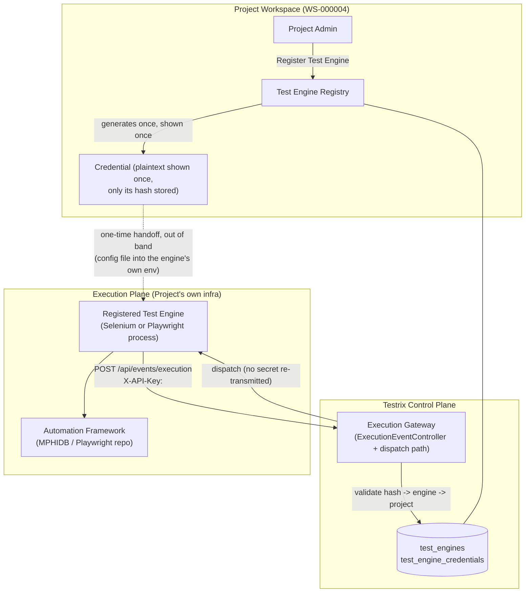
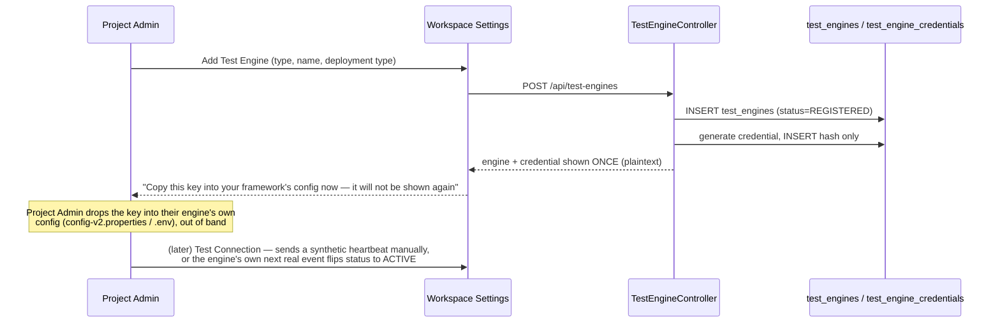
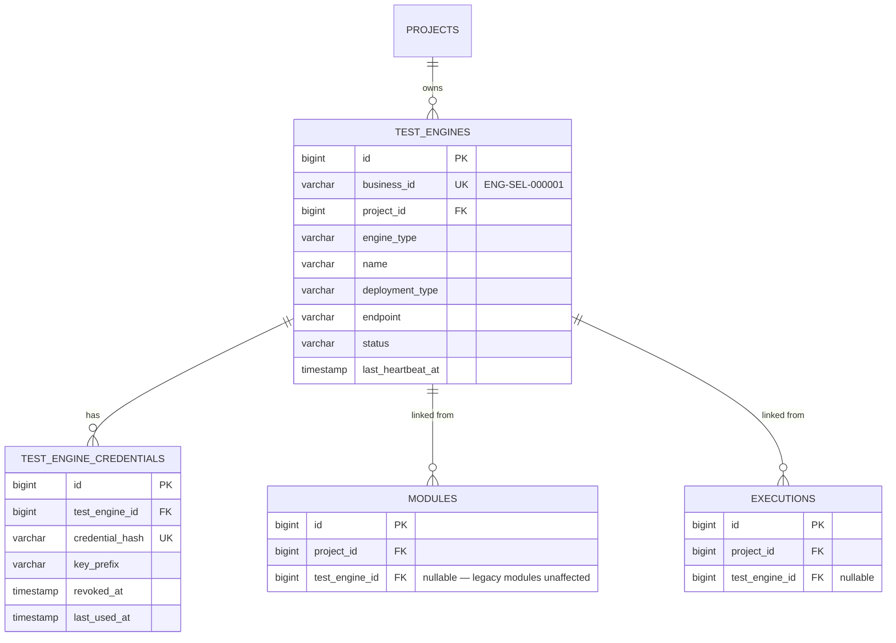

# Testrix Test Engine Integration Architecture (Plan 2)

> Answers `docs/version2.3.md`. Plan 2 depends on Plan 1 (`docs/version2.1.md` / `version2.2.md` —
> tenant/project/workspace isolation, role hierarchy), whose status was independently re-verified
> the same day this was written: 8/12 requirements DONE, 2 PARTIAL (workspace-request resubmission
> UX, per-role nav), all present in the working tree but uncommitted. Plan 2 only needs Plan 1's
> `projectId` ownership model to be real, which it is (`CurrentProjectService`, live-verified) — the
> two open Plan 1 gaps don't block Plan 2 and aren't addressed here.

---

## 1. Current State

Confirmed by reading the actual code (`docs/automation-framework-connection.md`, written the day
before this document, covers the same ground in more file-level detail — this section summarizes
the parts relevant to Plan 2's security model):

- **One global shared secret** (`portal.events.api-key` / `PORTAL_EVENTS_API_KEY`, mirrored as
  `em.portal-api-key` / `EM_PORTAL_API_KEY` in Execution Manager) authenticates *every* inbound
  execution event, platform-wide. `ExecutionEventController.isValidApiKey()` checks "does this
  match the one constant" — never "which engine, which project."
- **One global framework checkout per engine type** — `AUTOMATION_FRAMEWORK_REPO_PATH` (Selenium)
  and `AUTOMATION_PLAYWRIGHT_PATH` (Playwright) are single Docker bind mounts shared by every
  project, injected once in `docker-compose.yml`.
- **No Test Engine concept exists at all.** `ModuleEntity.runnerType` (free-text `MAVEN_TESTNG` /
  `PLAYWRIGHT`) is the only signal of which engine a module targets — there is no registry entity,
  no identity, no per-engine credential, no health/heartbeat, no ownership record beyond the
  module's own `project_id` (added in the Plan-1 Phase-3 isolation work).
- **Execution Manager (`QueueProcessor.dispatchJob()`) unconditionally injects its own static
  `portalApiKey`/`portalBackendUrl`** into every dispatch, regardless of job/module/project — this
  is the literal mechanism of the global-secret problem, not just a config value.
- The framework side (MPHIDB for Selenium, the Playwright repo) already reads its callback
  identity generically: Maven gets `-DportalApiKey=`, Playwright gets `PORTAL_API_KEY` env var,
  and both simply forward whatever value they were given as `X-API-Key` on every event POST. This
  matters a great deal for the target design (§3): **the framework side needs zero code changes**
  to support per-engine credentials, because it was never hardcoded to the global key — it just
  echoes back whatever it's configured with.
- Execution identity today: `executions.execution_code` (`AUTO-<FW>-<yyyyMMdd>-<seq>`, from the
  2026-08-02 redesign) plus `executions.project_id`. There is no `test_engine_id`, no
  request/correlation ID, and results are matched to executions purely by `execution_code` string
  match in `ExecutionEventService` — no ownership re-validation against the caller's identity
  beyond the one global key.

---

## 2. Gaps Against Plan 2's Acceptance Criteria

| # | Acceptance criterion (`version2.3.md` §44) | Status before this change |
|---|---|---|
| 3 | Each Test Engine has a unique identity | Missing — no registry |
| 4 | Each Test Engine has independent credentials | Missing — one global key |
| 5 | Global shared secret is removed/replaced | Not done — still the only mechanism |
| 8 | Multiple Workspaces can register separate Engines | Not possible — no registration flow |
| 11/12 | Results cannot cross Workspace/Project boundaries | Partially true only because there's one workspace live today; the *mechanism* to prevent it doesn't exist — any holder of the global key can post an event for any execution code |
| 13 | Test Engine health is visible | Missing |
| 14 | Credentials can be rotated/revoked | Missing |
| 18/19 | Existing Selenium/Playwright functionality preserved | Achievable with zero framework-side changes (see §1) |

---

## 3. Target Architecture



Core principle carried over unchanged from Plan 2 §"CORE ARCHITECTURAL PRINCIPLE": Testrix is the
**control plane** (identity, authorization, result ingestion); the registered engine is the
**execution plane** (runs the actual framework). Testrix never re-transmits a credential at
dispatch time — the engine already holds its own key from the one-time registration handoff, and
Testrix only ever verifies a *hash* against what comes back. This is what makes global-key removal
possible without any framework-repo code change.

### 3.1 Test Engine Registry

`test_engines` — one row per registered engine, owned by exactly one `project_id` (never a
workspace-less/Super-Admin row, consistent with `CurrentProjectService`'s existing rule).

| Field | Notes |
|---|---|
| `business_id` | `ENG-SEL-000001` / `ENG-PW-000001` — via the existing `EntityIdGeneratorService.next("ENG-SEL"\|"ENG-PW")`, same immutable-ID pattern already used for `TEN-`/`PRJ-`/`WS-`/`USR-`/`ROL-`/`ENV-`. Stable across redeploys, endpoint changes, container recreation — matches §7's requirement directly, since it's a DB row, not derived from anything transient. |
| `project_id` | FK, never null — the ownership model is `Project -> Test Engine` (Workspace *is* Project per the existing `docs/automation-framework-connection.md` finding; a separate `Workspace` table doesn't exist and re-deriving one here would contradict that prior decision). |
| `engine_type` | `SELENIUM` \| `PLAYWRIGHT` (extensible string, not a rigid enum, so `CYPRESS`/`APPIUM` etc. need no migration — §39). |
| `name`, `description` | Free text. |
| `deployment_type` | `LOCAL` \| `DOCKER` \| `VM` \| `KUBERNETES` \| `OTHER`. |
| `endpoint` | Optional — informational only today (no engine-initiated pull exists yet; execution dispatch still goes through the shared Framework Runner, see §7 "What Plan 3 leaves open"). |
| `status` | `REGISTERED` \| `ACTIVE` \| `OFFLINE` \| `DISABLED` (§33's lifecycle, trimmed — `CONNECTING`/`BUSY`/`IDLE`/`DELETED` are collapsible into these four without losing anything actionable today; see §8 for why). |
| `last_heartbeat_at` | Nullable; drives `OFFLINE` inference. |
| `created_at`, `updated_at`, `created_by_user_id` | Standard audit columns. |

`test_engine_credentials` — separate table (not a column on `test_engines`) so history survives
rotation:

| Field | Notes |
|---|---|
| `test_engine_id` | FK. |
| `credential_hash` | SHA-256 hex of the raw key. Never store or log the raw value after generation. |
| `key_prefix` | First 8 chars of the raw key, kept in the clear for the UI to display ("Active key: `tk_a1b2c3d4...`") without ever re-showing the full secret — same pattern GitHub/Stripe use for token identification. |
| `created_at`, `revoked_at`, `last_used_at` | `revoked_at IS NULL` = currently active. Only one active credential per engine at a time (rotation revokes the old one atomically). |

### 3.2 Execution Identity

Extended, not replaced — `executions.test_engine_id` (nullable FK) is added alongside the existing
`execution_code`/`project_id`. Nullable because un-migrated modules (no engine registered yet)
must keep working exactly as today (§44 criterion 18/19) — see §6's fallback rule.

### 3.3 Registration Flow (implemented)



Only non-Viewer project roles can reach `POST/PUT/DELETE /api/test-engines/**` — enforced for free
by the existing blanket `JwtAuthenticationFilter` rule (any mutating verb + all-Viewer roles = 403
"Viewer role is read-only", live-verified 2026-08-08 audit), so no new role-check code was needed
to satisfy §5's "Viewer must NOT be allowed to register a Test Engine."

### 3.4 Callback Security (implemented)

`ExecutionEventController.receiveEvent()` now resolves `X-API-Key` in this order:

1. Hash the incoming key, look up `test_engine_credentials` for a matching, non-revoked row.
2. If found: load the execution by `executionId` (execution_code), and reject (403) if the
   execution's `project_id` doesn't match the resolved engine's `project_id` — this is §23's
   "Engine A attempts Execution A → Workspace B, must be rejected" rule, implemented literally.
3. If not found by hash: fall back to the legacy global `portal.events.api-key` check, so today's
   un-migrated pilot workspace and any module without a registered engine keep working unchanged
   (§44 criterion 6/18/19 — "local development remains possible", "existing functionality
   preserved"). This fallback is the one deliberate, temporary exception to "no global shared
   secret" and is called out explicitly in the code and in §6 below — it is not hidden.

### 3.5 Dispatch Path (implemented)

The key insight (§1): the framework never needed Testrix to hand it a key at dispatch time — it
was only ever designed that way because there was nothing else to configure it with. Once an
engine has its own credential (handed over once at registration), the correct, more secure
behavior is for Testrix to **stop transmitting any secret at dispatch time** for engine-linked
modules, and let the framework use the key it already has:

```
ExecutionWorker resolves module -> module.testEngineId present?
    yes -> include testEngineCode in the /em/executions payload, do NOT resolve/pass an apiKey
    no  -> unchanged legacy path (EM injects its static global key, as today)

QueueProcessor.dispatchJob():
    job.testEngineCode present -> pass apiKey="" to RunnerClient (portalUrl still passed — it's
                                   not a secret, and today it's the same gateway URL for everyone)
    else                       -> unchanged: pass EM's static portalApiKey (legacy path)

FrameworkRunnerService.runMaven()/runPlaywright(): unchanged. Already guards
    `if (apiKey != null && !apiKey.isEmpty())` before adding -DportalApiKey — an empty key is
    already handled correctly as "don't override, let the framework's own config win."
```

Zero changes to `framework-runner/`'s Maven/Playwright invocation logic, and zero changes to the
external MPHIDB/Playwright repos, were needed for this. That is by design, not an accident — see
§1's note on why the framework side was already engine-agnostic.

### 3.6 Engine Status Guard (implemented)

`ExecutionWorker.processExecution()` now rejects (sets `ExecutionStatus.ERROR` with a clear log
line) before ever calling Execution Manager if the resolved module's engine has
`status = DISABLED`. This is the synchronous half of §10's "Check Engine Status" step. The
heartbeat-driven `OFFLINE` state is informational only for now — rejecting dispatch on staleness
alone was deliberately **not** implemented, because no engine has started sending real heartbeats
yet and a false-`OFFLINE` would block the one working pilot workspace. Revisit once real heartbeat
traffic exists (see §8).

### 3.7 Heartbeat (implemented, minimal)

`POST /api/test-engines/{id}/heartbeat` — authenticated by the engine's own `X-API-Key` (not a
user JWT, since this call originates from the engine process, not a browser). Updates
`last_heartbeat_at` and flips `status` to `ACTIVE` if it was `REGISTERED`/`OFFLINE`. No framework
side calls this yet (would require adding a heartbeat call to MPHIDB/Playwright's own code, out of
scope for "don't rewrite the framework repos" — see §8). `GET /api/test-engines/{id}/health`
derives `HEALTHY`/`STALE`/`NEVER_CONNECTED` from `last_heartbeat_at` age (>10 min = `STALE`) for
the UI to display, satisfying §44 criterion 13 ("Test Engine health is visible") as a passive
signal even before any engine actively pings it (a real execution's callback events also count as
liveness and update `last_heartbeat_at`, so an engine that's actively running suites shows
`ACTIVE` without needing a separate heartbeat call at all).

### 3.8 Credential Lifecycle (implemented)

`POST /api/test-engines/{id}/credential/rotate` — generates a new key, revokes the old one
(`revoked_at = now()`) atomically, returns the new plaintext once. `POST
.../credential/revoke` — revokes without generating a replacement (engine goes dark until
rotated again). Matches §19's `Generate -> Store Securely -> Use -> Rotate -> Revoke -> Regenerate`
lifecycle; "Store Securely" = hash-only storage, "never displayed in plaintext after initial
generation" is enforced by the API never returning `credential_hash` or reconstructing plaintext
in any GET response.

---

## 4. Common Test Engine Contract (§12)

| Contract item | Mechanism |
|---|---|
| Registration | `POST /api/test-engines` |
| Authentication | Per-engine credential, `X-API-Key` header, hash-validated |
| Health Check | `GET /api/test-engines/{id}/health` |
| Heartbeat | `POST /api/test-engines/{id}/heartbeat` |
| Capability Discovery | **Not implemented** — see §8 |
| Execute | Existing `POST /api/executions/run` -> Execution Manager -> Framework Runner path, unchanged; engine identity now threaded through as described in §3.5 |
| Execution Status | Existing `GET /api/executions/{id}` |
| Execution Event | Existing `POST /api/events/execution`, now credential-resolved per §3.4 |
| Logs / Screenshots / Artifacts | Existing endpoints, unchanged |
| Final Result | Existing `SUITE_COMPLETED` event + `TestNGXmlParser` merge, unchanged |
| Failure | Existing `TEST_FAILED` event, unchanged |
| Cancellation | Existing `POST /runner/cancel` path, unchanged |
| Retry | Not implemented (matches "Optional" in §12) |

---

## 5. Database Design (implemented — see `V25__test_engine_registry.sql`)



`execution_jobs` (Execution Manager's own table, but schema-owned by the backend's Flyway history
— an existing, pre-established pattern, not new to this change) gains `test_engine_code VARCHAR(50)
NULL` — a denormalized copy of the business ID, since Execution Manager is a separate Spring
context with no JPA awareness of `TestEngine` and only needs a presence check (§3.5), not a join.

---

## 6. What Was Deferred, and Why

Following the spec's own instruction not to over-build (§6: "Do not blindly implement every
field... determine the minimum correct production-ready model") and not to rewrite the external
framework repos without necessity (§34/§35):

- **Capability Discovery (§21)** — dynamic "which browsers/features does this engine support"
  querying is not built. Nothing in the current pipeline needs it yet (there's exactly one
  Selenium engine and one Playwright engine, both fully capable of everything they're asked to
  run). Would require the framework side to expose a new endpoint Testrix can query — real
  framework-repo work, correctly out of scope until a second, differently-capable engine exists.
- **Selenium/Playwright Adapter rewrites (§13, §34, §35)** — not needed. §3.5 explains why: the
  existing generic `apiKey`/`portalUrl` contract already works per-engine with zero framework code
  changes. An "Adapter" layer would be pure ceremony without a concrete need it solves today.
- **Idempotency keys (§27)** — execution creation already can't duplicate in practice (single
  `RUNNING`-at-a-time gate, unique `execution_code` sequence) — a formal `Idempotency-Key` header
  was not added since no real retry-storm scenario exists yet to motivate it.
- **Distributed runner pool / scheduler / queue (§38)** — explicitly Plan 3, explicitly out of
  scope for Plan 2 per the spec itself ("Do NOT implement Plan 3 in this task"). The
  `test_engines` registry is deliberately shaped to support it later (already supports N engines
  per project) without redesign.
- **The global-key fallback (§3.4 point 3)** stays in place, not removed outright — removing it
  today would break the one live pilot workspace's modules that have no registered engine yet.
  Migrating them (registering an engine + linking existing Modules to it via the new Manage
  Modules picker) is an operational step for the project owner, not a code change.
- **Engine-initiated heartbeat from inside MPHIDB/Playwright** — the endpoint exists (§3.7) but
  nothing calls it yet, since wiring that in means editing the external framework repos, which
  §34/§35 says to avoid without necessity. Real execution events already provide equivalent
  liveness signal today.

---

## 7. What Belongs Where (§40's requirement)

| Belongs to | What |
|---|---|
| **Testrix** | Test Engine Registry, credential hashing/validation, Execution Gateway (dispatch + callback), Workspace/Project isolation, Dashboard/Reports |
| **The Test Engine** | The registered identity + credential; today this *is* the shared Framework Runner process (`framework-runner/`), which now looks up per-execution whether to expect a per-engine key or fall back to the legacy one |
| **The Automation Repository** | MPHIDB (Selenium) / the Playwright repo — completely unmodified by this change |
| **The Agent/Adapter** | Not introduced — deliberately unnecessary today, see §6 |

---

## 8. Migration Plan for the Existing Pilot Workspace

1. Project Admin opens Workspace Settings -> Test Engines -> "Add Test Engine" for Selenium and/or
   Playwright.
2. Copies the shown-once key into MPHIDB's `config-v2.properties` (`portal.api.key=...`) and/or
   the Playwright repo's `.env` (`PORTAL_API_KEY=...`) — the exact same fields these files already
   have today, just populated with a real per-engine value instead of the platform's global one.
3. In Manage Modules (admin), assign each existing Module to the new Test Engine via the added
   picker.
4. From that point on, that module's runs use the per-engine credential automatically (§3.5); the
   legacy global key stops being used for it, though it remains valid for any module not yet
   migrated.

No forced cutover date — both paths work simultaneously, satisfying §44 criterion 6/18/19 during
the transition.
